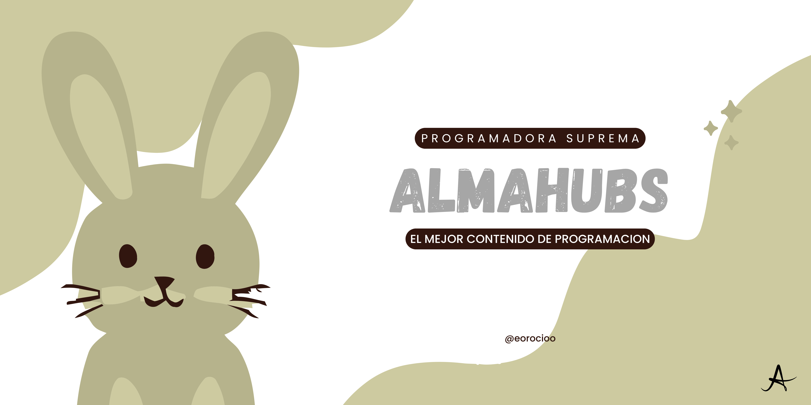

<h1 align="center">Hi 👋, I'm Alma Elibeth Orocio Mora</h1>
<h3 align="center">A passionate frontend developer from Mexico</h3>

  
  

  

<h3 align="left">Connect with me:</h3>

- 🔭 I’m currently working on **Mejorar mi perfil de Github**

- 🌱 I’m currently learning **A darme a conocer en mi programacion de GitHub y Visual**

- 👯 I’m looking to collaborate on **programacion de Github y Visual con edna**

- 🤝 I’m looking for help with **Buscar Colaboradores para programas**

- 👨‍💻 All of my projects are available at [https://github.com/Orocioe](Internet)

- 📝 I regularly write articles on [https://github.com/Orocioe](Mi)

- 💬 Ask me about **mi, me gusta hablar de mi**

- 📫 How to reach me **omelibeth3@gmail.com**

- 📄 Know about my experiences [Sobre programacion](Sobre programacion)

- ⚡ Fun fact **Me desarrollo muy bien en mi area**

<h3 align="left">Languages and Tools:</h3>

          

